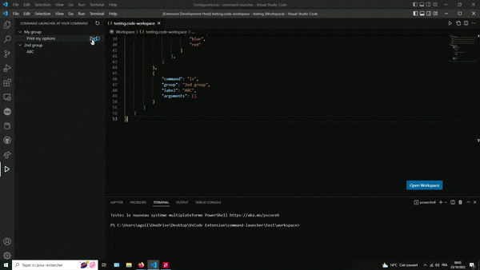

# command-launcher README

This extension allows you to execute commands with list of differents type of arguments (promptString, pickString, raw string).

## Features

Run command with any sequences of promptString, pickString or raw string parameters.



Support some variable substitution:

    "${file}"
    "${pathSeparator}"
    "${fileBasename}"
    "${fileBasenameNoExtension}"
    "${fileExtname}"
    "${fileDirname}"

## Extension Settings

| Settings                 | Description                                                 |
| ------------------------ | ----------------------------------------------------------- |
| commandLauncher.actions  | Array of actions containing  command, args, label and group.|

Exemple:

```
"settings": {
    "commandLauncher.actions": [{
            "command": "echo",
            "group": "My group",
            "label": "Print my options",
            "arguments": [
                "hello",
                {
                    "options": [
                        "world",
                        "to you"
                    ]
                },
                {
                    "inputContext": "Please, enter a name."
                },
                {
                    "options": [
                        "blue",
                        "red"
                    ]
                },
            ]
        },
        {
            "command": "ls",
            "group": "2nd group",
            "label": "ABC",
            "arguments": []
        }
    ]
}
```

## Release Notes

### 0.0.2

Support some variable substitution.
Add precommand.

### 0.0.1

Initial release.
